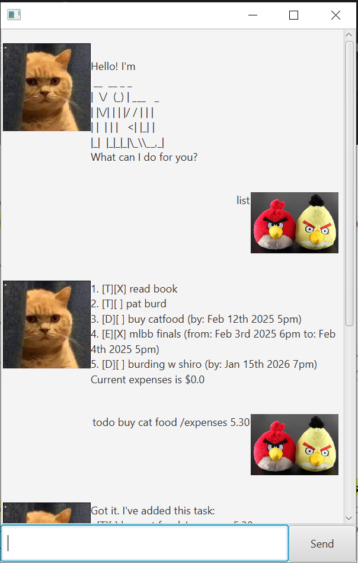

# Miku User Guide

// Product screenshot goes here


// Product intro goes here
Use Miku to keep track of a list of tasks and events you have, as well as track any expenses!

## Adding deadlines

// Describe the action and its outcome.
Add any important deadlines you have, indicate the date and any expenses.

// Give examples of usage
`deadline <description> (/expenses <expenses>) /by <date>`
Example: 
`deadline feed cat /expenses 5.25 /by Jan 7th 2025 5pm`


// A description of the expected outcome goes here

```
Got it. I've added this task:
[D][ ] feed cat /expenses 5.25 (by: Jan 7th 2025 5pm)
Now you have 7 tasks in this list.
```

## Adding todos

// Describe the action and its outcome.
Add any important takss you have, indicating any expenses.

// Give examples of usage
`todo <description> (/expenses <expenses>)`
Example: 
`todo feed cat /expenses 5.25`


// A description of the expected outcome goes here

```
Got it. I've added this task:
[T][ ] feed cat /expenses 5.25
Now you have 7 tasks in this list.
```

## Adding events

// Describe the action and its outcome.
Add any important events you have, indicate from when to when and any expenses.

// Give examples of usage
`event <description> (/expenses <expenses>) /from <date> /to <date>`
Example: 
`event feed cat /expenses 5.25 /from Jan 7th 2025 5pm /to Jan 7th 2025 6pm`


// A description of the expected outcome goes here

```
Got it. I've added this task:
[E][ ] feed cat /expenses 5.25 (from: Jan 7th 2025 5pm to: Jan 7th 2025 6pm)
Now you have 7 tasks in this list.
```