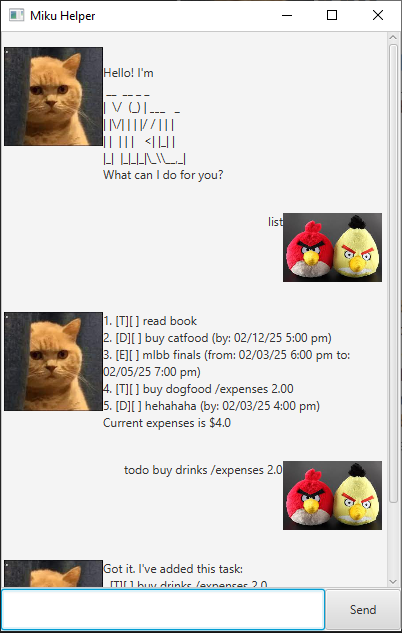

# Miku User Guide



Use Miku to keep track of a list of tasks and events you have, as well as track any expenses!

## Adding deadlines

Add any important deadlines you have, indicate the date and any expenses.

`deadline <description> (/expenses <expenses>) /by <date>`
Example: 
`deadline feed cat /expenses 5.25 /by Jan 7th 2025 5pm`


```
Got it. I've added this task:
[D][ ] feed cat /expenses 5.25 (by: Jan 7th 2025 5pm)
Now you have 7 tasks in this list.
```

## Adding todos

Add any important takss you have, indicating any expenses.

`todo <description> (/expenses <expenses>)`
Example: 
`todo feed cat /expenses 5.25`


```
Got it. I've added this task:
[T][ ] feed cat /expenses 5.25
Now you have 7 tasks in this list.
```

## Adding events

Add any important events you have, indicate from when to when and any expenses.

`event <description> (/expenses <expenses>) /from <date> /to <date>`
Example: 
`event feed cat /expenses 5.25 /from Jan 7th 2025 5pm /to Jan 7th 2025 6pm`


```
Got it. I've added this task:
[E][ ] feed cat /expenses 5.25 (from: Jan 7th 2025 5pm to: Jan 7th 2025 6pm)
Now you have 7 tasks in this list.
```

## Listing tasks

List all tasks.

Example: 
`list`

```
1. [T][ ] feed burd /expenses 5.00
2. [D][X] feed dog /expenses 5.00 (by: Jan 7th 2025 5pm)
3. [E][ ] feed cat /expenses 5.00 (from: Jan 7th 2025 5pm to: Jan 7th 2025 6pm)
Current expenses is $15.00
```

## Deleting tasks

Delete a task.

Example: 
`delete 1`

```
Noted. I've removed this task:
  [T][ ] pat burd
Now you have 4 tasks in the list.
```

## Mark tasks

Mark a task.

Example: 
`mark 1`

```
Nice! I've marked this task as done:
  [T][X] pat burd
```


## Unmark tasks

Unmark a task.

Example: 
`umark 1`

```
OK, I've marked this task as not done yet:
  [T][ ] pat burd
```

## Find tasks

Find some tasks with search keywords. This command will match any words in the descriptions of tasks.

Example: 
`find burd`

```
1. [T][ ] feed burd /expenses 5.00
```